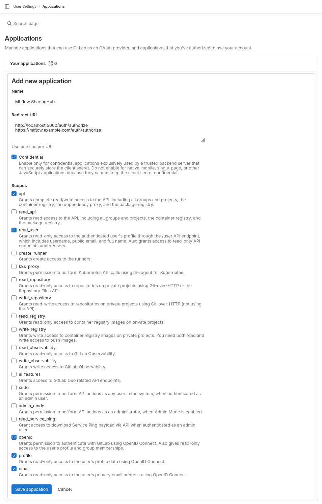

# MLflow SharingHub


[](https://www.python.org/)


[Merge Request]( https://github.com/csgroup-oss/mlflow-sharinghub/merge_requests) **·**
[Bug Report]( https://github.com/csgroup-oss/mlflow-sharinghub/issues/new?issuable_template=bug_report) **·**
[Feature Request]( https://github.com/csgroup-oss/mlflow-sharinghub/issues/new?issuable_template=feature_request)

MLflow is a platform to streamline machine learning development, including tracking experiments, packaging code into reproducible runs, and sharing and deploying models.

SharingHub is an AI-focused web portal designed to help you discover, navigate, and analyze your AI-related Git projects hosted on GitLab.

This repository hosts a MLflow "app" plugin that integrates it with SharingHub and GitLab permission system. The plugin also isolates the experiments from each others per GitLab project.

## Table of Contents

- [Getting started](#getting-started)
  - [Configuration](#configuration)
    - [For GitLab](#for-gitlab)
    - [For SharingHub](#for-sharinghub)
  - [Usage](#usage)
    - [Local](#local)
    - [Docker](#docker)
- [Deployment guide](#deployment-guide)
  - [Docker image](#docker-image)
    - [Build image](#build-image)
    - [Push image](#push-image)
  - [Create a robot account](#create-a-robot-account)
  - [Create a secret key](#create-a-secret-key)
  - [Integration configuration](#integration-configuration)
    - [GitLab](#gitlab)
    - [SharingHub](#sharinghub)
  - [MLflow server storage](#mlflow-server-storage)
    - [Backend store](#backend-store)
      - [PostgreSQL](#postgresql)
        - [From the charts dependency](#from-the-charts-dependency)
        - [For existing instance](#for-existing-instance)
    - [Artifacts store](#artifacts-store)
      - [S3](#s3)
  - [Deploy](#deploy)
- [Contributing](#contributing)
- [Copyright and License](#copyright-and-license)

## Getting started

### Configuration

MLflow SharingHub can be configured with a GitLab instance, or a SharingHub instance.

#### For GitLab

First, create a file named `.env` and edit the content:

```txt
PROJECT_CACHE_TIMEOUT=30
LOGIN_AUTO_REDIRECT=false

GITLAB_URL=https://gitlab.example.com
GITLAB_OAUTH_CLIENT_ID=<client-id>
GITLAB_OAUTH_CLIENT_SECRET=<client-secret>
```

The `client-id` and `client-secret` can be created in your GitLab User settings (Preferences).
You must create an "Application" with the scopes `api read_user openid profile email`.
The callback URL is `http://localhost:5000/auth/authorize`.

#### For SharingHub

The configuration may vary depending on your instance config. First, create a file named `.env` and edit the content.

If you have a default token configured:

```txt
PROJECT_CACHE_TIMEOUT=30
LOGIN_AUTO_REDIRECT=false

SHARINGHUB_URL=http://sharinghub.example.com
SHARINGHUB_AUTH_DEFAULT_TOKEN=true
```

else:

```txt
PROJECT_CACHE_TIMEOUT=30
LOGIN_AUTO_REDIRECT=false

SHARINGHUB_URL=http://sharinghub.example.com
```

With this integration MLflow SharingHub will use the session cookie of SharingHub to interact with the SharingHub Server.

### Usage

#### Local

Being an MLflow plugin, in order to use it you'll have to install this project first. It is recommended to use a virtualenv.

```bash
pip install .
# OR
make install
```

Now you can run the mlflow server, you just need to add the parameter `--app-name sharinghub` to enable the plugin.

Example:

```bash
mlflow server --app-name sharinghub
```

And to enable hot-reload, add the `--dev`.

```bash
mlflow server --app-name sharinghub --dev
```

> Note: the make targets `run` and `run-dev` should be preferred as they add more arguments.

#### Docker

Build the image:

```bash
docker build . -t mlflow-sharinghub:latest --build-arg VERSION=$(git rev-parse --short HEAD)
# OR
make docker-build
```

```bash
docker run --rm -v $(pwd)/data:/home/mlflow/data -p 5000:5000 --env-file .env --name mlflow-sharinghub mlflow-sharinghub:latest
# OR
make docker-run
```

## Deployment guide

First, create a values file, like `./deploy/helm/values.<platform>.yaml`. It will serve as your deployment values file.

> Note: values named like `<var>` are "variables", expected to be filled by your real values.

### Docker image

This project is delivered as a docker image, you will need to publish it to a docker registry in order to deploy the service.

#### Build image

You can build the image with the following command:

```bash
docker build . -t <docker-registry>/mlflow-sharinghub:latest
```

#### Push image

After building the image you can push it to your registry:

```bash
docker push <docker-registry>/mlflow-sharinghub:latest
```

### Create a robot account

If you don't already have one in the namespace, create a robot account in the docker registry to access the image.

```bash
kubectl create namespace sharinghub

kubectl create secret docker-registry regcred --docker-username='<robot-username>' --docker-password='<robot-password>' --docker-server='<docker-registry>' --namespace sharinghub
```

### Create a secret key

The server needs a secret key for security purposes, create the secret:

```bash
kubectl create secret generic mlflow-sharinghub --from-literal secret-key="<random-secret-key>" --namespace sharinghub
```

### Integration configuration

As detailed in [Configuration](#configuration), MLflow SharingHub can be configured to use either SharingHub or GitLab for permission management of projects. Follow the instructions for only one.

#### GitLab

Configure your deployment values:

```yaml
gitlabUrl: https://<gitlab-domain>
gitlabMandatoryTopics: "sharinghub:aimodel" # from sharinghub configuration
```

You will need to create an application in your Gitlab instance in order to use MLflow SharingHub integration of GitLab.

Configure an application in the GitLab instance for OpenID connect authentication:



Callback URLs example:

```txt
http://localhost:5000/auth/authorize
https://mlflow.<domain-name>/auth/authorize
```

> Note: localhost URL is for development purposes, if you don't want it you can remove it.

You must then create the secret containing the OIDC secrets.

```bash
kubectl create secret generic mlflow-sharinghub-gitlab --from-literal client-id="<gitlab-app-client-id>" --from-literal client-secret="<gitlab-app-client-secret>" --namespace sharinghub
```

#### SharingHub

Configure your deployment values:

```yaml
sharinghubUrl: https://sharinghub.<domain-name>
sharinghubStacCollection: "ai-model"
sharinghubAuthDefaultToken: true
```

Take note that it is important for your SharingHub instance to write its session cookie on `<domain-name>`.

### MLflow server storage

The MLflow server is rather flexible in the location were its data and artifacts are stored, and each can be configured.

#### Backend store

By default, our docker image uses an sqlite database (a single file) for the data, located at `/home/mlflow/data/mlflow.db`.

##### PostgreSQL

You can alternatively choose PostgreSQL as a database.

###### From the charts dependency

First, create the secret that will contain PostgreSQL passwords:

```bash
kubectl create secret generic mlflow-sharinghub-postgres --from-literal password="<mlflow-user-password>" --from-literal postgres-password="<root-user-password>" --namespace sharinghub
```

Then, configure the deployment values:

```yaml
postgresql:
  enabled: true
  auth:
    existingSecret: mlflow-sharinghub-postgres
```

###### For existing instance

Edit your `mlflow-sharinghub` secret that contains the key `secret-key`, and add a new key named `backend-store-uri` with the value `postgresql://<user>:<password>@<host>:5432/<database>`, filled with your PostgreSQL instance values.

Then, configure the deployment values:

```yaml
mlflowSharinghub:
  backendStoreUriSecret: true
```

#### Artifacts store

By default, our docker image uses a directory for the artifacts, located at `/home/mlflow/data/mlartifacts`.

##### S3

You can alternatively choose to store your artifacts in an S3.

If you chose to use one, you need to create a s3 bucket in your provider and create the associated secret:

```bash
kubectl create secret generic mlflow-sharinghub-s3 --from-literal access-key-id="<access-key>" --from-literal secret-access-key="<secret-key>" --namespace sharinghub
```

Then, configure the deployment values:

```yaml
mlflowSharinghub:
  artifactsDestination: s3://<bucket>

s3:
  enabled: true
  endpointUrl: https://<s3-endpoint>
```

### Deploy

You must edit your deployment values with these last pieces of informations:

```yaml
image:
  repository: <docker-registry>/mlflow-sharinghub
  pullPolicy: IfNotPresent
  tag: "latest"

imagePullSecrets:
  -  name: regcred

ingress:
  enabled: true
  className: "nginx"
  annotations:
    cert-manager.io/cluster-issuer: letsencrypt-prod
  hosts:
    - host: mlflow.<domain-name>
      paths:
        - path: /
          pathType: ImplementationSpecific
  tls:
    - secretName: mlflow-sharinghub-tls
      hosts:
        - mlflow.<domain-name>
```

When all is done, install/update your deployment:

```bash
# Install & Update
helm upgrade --install --create-namespace --namespace sharinghub mlflow-sharinghub ./deploy/helm/mlflow-sharinghub -f ./deploy/helm/values.<platform>.yaml
```

## Contributing

If you want to contribute to this project or understand how it works,
please check [CONTRIBUTING.md](./CONTRIBUTING.md).

Any contribution is greatly appreciated.

## Copyright and License

Copyright 2024 `CS GROUP - France`

**MLflow SharingHub**  is an open source software, distributed under the Apache License 2.0. See the [`LICENSE`](./LICENSE) file for more information.
